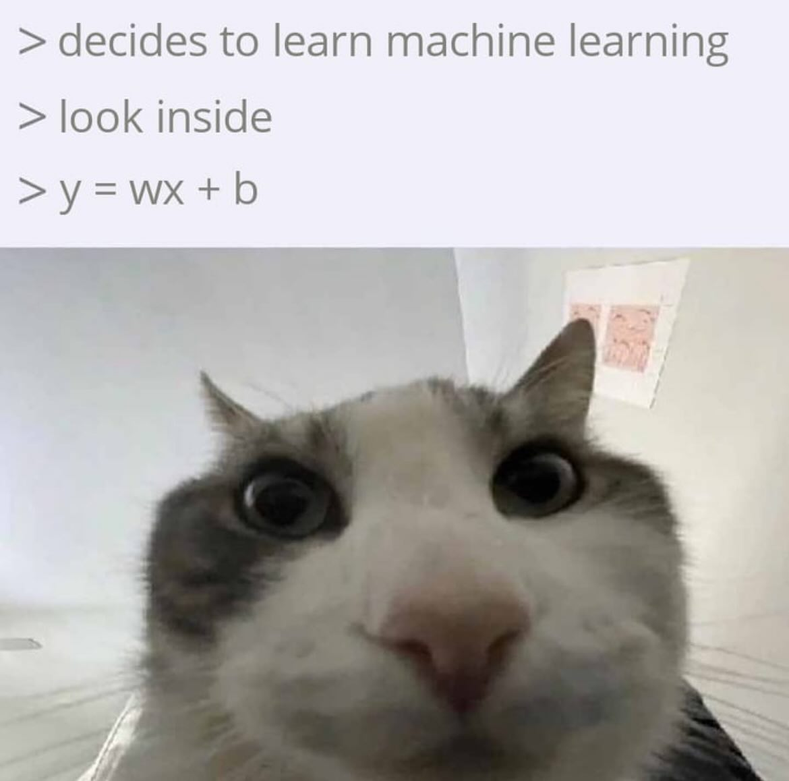

# 🤖 ML/AI Code Templates & Practice Repository 🧠

<div align="center">
  
</div>

## 📚 Repository Overview
This is my personal knowledge base for Machine Learning and Artificial Intelligence implementations. Contains:
- Code templates for common tasks
- Experimental implementations
- Learning progress documentation
- Best practice examples

## 🧠 Knowledge Bank Status
```text
Status: Actively maintained
Last Updated: 13/02/2025
ML Focus: Practical implementations > Theoretical math
```

#### Created with ❤️ by Joao Victor Botelho Goncalves | Part of my continuous learning journey in AI/ML